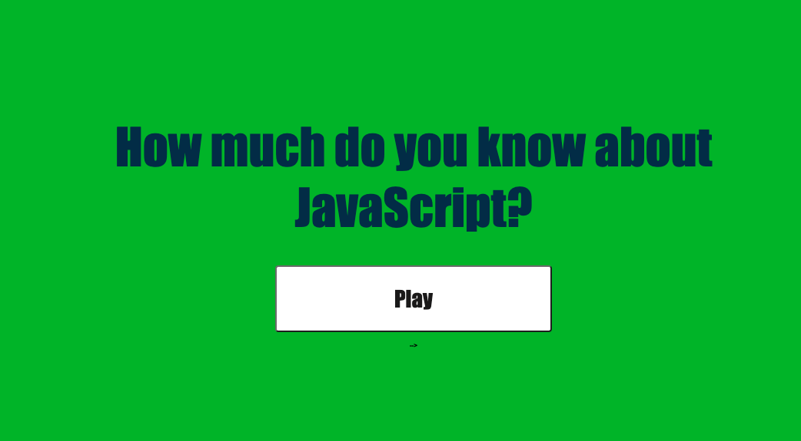

# Title: Javascript Quiz
Challenge 4 Assignment
Columbia-2U Fullstack Coding Bootcamp

#Description
The purpose of this assignment was to challenge us to create a timed quiz that also stores data when the game is over.

#Technologies Used
HTML, CSS, JavaScript, Web APIs.

#Link to deployed application
